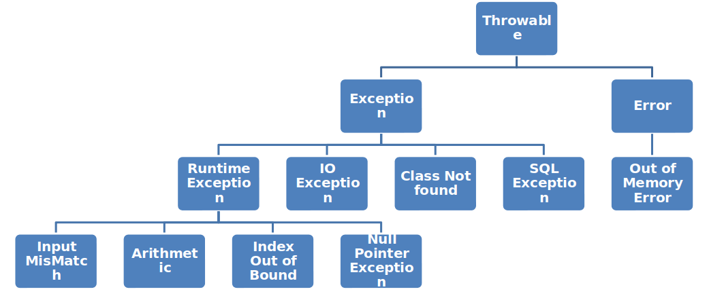

# EXCEPTION

<ul>

<li>FileNotFoundException</li>
<li>ClassNotFoundException</li>
<li>SQLException</li>
<li>
 <h2>RUNTIME EXCPETIONS:</h2>
<ul>
<li>InputMismatchException</li>
<li>ArithmeticException</li>
<li>IndexOutOfBoundsException</li>
<li>NullPointerException</li>
<li>NoSuchElementException</li>
</ul>
</li>
</ul>

## EXCEPTION CLASS HEIRARCHY

