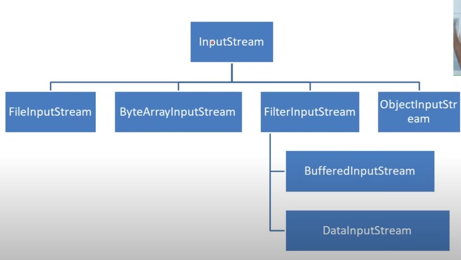
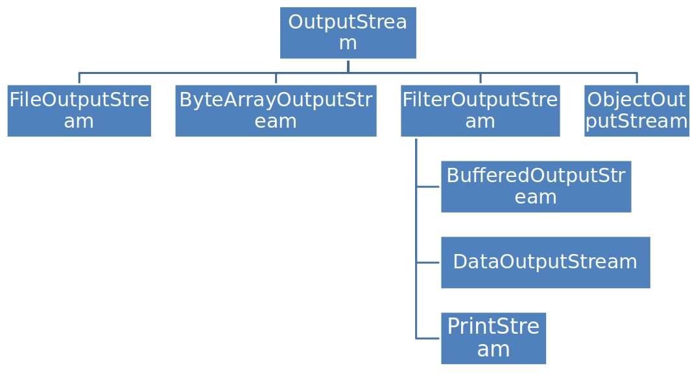

# METHODS OF File CLASS

> ## Call these methods on File object, i.e new File().method
>
>>public String getName()
>>
>>public String getParent()
>>
>>public String getPath()
>>
>>public boolean isAbsolute()
>>
>>public String getAbsolutePath()
>>
>>public boolean canRead()
>>
>>public boolean canWrite()
>>
>>public boolean exists()
>>
>>public boolean isDirectory()
>>
>>public boolean isFile()
>>
>>public long length()
>>
>>public boolean createNewFile() throws IOException
>>
>>public boolean delete()
>>
>>public String[] list()
>>
>>public File[] listFiles()
>>
>>public boolean mkdir()
>>
>>public boolean renameTo(File dest)
>>
>>public int compareTo(File pathname)
>>
>>public String toString()  

 
 

# Input stream heirarchy

 
- in of System.in is a object of InputStream class
 

# METHODS OF FileInputStream CLASS

> ## Call these methods on FileInputStream object, i.e new FileInputStream().method
>
>>int read()
>>
>>int read(byte[] b)()
>>
>>int read(byte[] b, int off, int len)()
>>
>>int available()
>>
>>void close()

 
 

# Output stream heirarchy

 
- out of System.out is a object of OutputStream class
 

# METHODS OF FileOutputStream CLASS

> ## Call these methods on FileOutputStream object, i.e new FileOutputStream().method
>
>>int write(int b)
>>
>>int write(byte[] b)()
>>
>>int write(byte[] b, int off, int len)()
>>
>>void close()

 
- Always close an input stream before accessing a file using output stream and vice versa
 