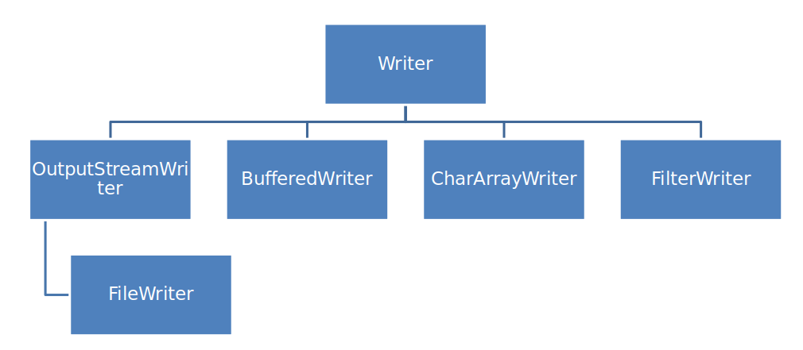

# METHODS OF File CLASS

> ## Call these methods on File object, i.e new File().method
>
>>public String getName()
>>
>>public String getParent()
>>
>>public String getPath()
>>
>>public boolean isAbsolute()
>>
>>public String getAbsolutePath()
>>
>>public boolean canRead()
>>
>>public boolean canWrite()
>>
>>public boolean exists()
>>
>>public boolean isDirectory()
>>
>>public boolean isFile()
>>
>>public long length()
>>
>>public boolean createNewFile() throws IOException
>>
>>public boolean delete()
>>
>>public String[] list()
>>
>>public File[] listFiles()
>>
>>public boolean mkdir()
>>
>>public boolean renameTo(File dest)
>>
>>public int compareTo(File pathname)
>>
>>public String toString()  

 
 

# Input stream heirarchy

 
 
- in of System.in is a object of InputStream class
 
 

# METHODS OF FileInputStream CLASS

> ## Call these methods on FileInputStream object, i.e new FileInputStream().method
>
>>int read()
>>
>>int read(byte[] b)()
>>
>>int read(byte[] b, int off, int len)()
>>
>>int available()
>>
>>void close()

 
 

# Output stream heirarchy

 
 
- out of System.out is a object of OutputStream class
 
 

# METHODS OF FileOutputStream CLASS

> ## Call these methods on FileOutputStream object, i.e new FileOutputStream().method
>
>>int write(int b)
>>
>>int write(byte[] b)()
>>
>>int write(byte[] b, int off, int len)()
>>
>>void close()

 
 
- Always close an input stream before accessing a file using output stream and vice versa
 
 

- ## FileInput and FileOutput Streams reads and writes bytes
- ## To read and write characters we can use FileReader and FileWriter  
  
 
 

# Reader heirarchy

 
 

# METHODS OF FileReader CLASS
- FilReader assumes the default encoding of files in the system to be the appropriate one

> ## Call these methods on FileReader object, i.e new FileReader().method
>
>>int read()
>>
>>int read(char[] c)()
>>
>>int read(char[] c, int off, int len)()
>>
>>void close()

 
 

# Writer heirarchy

 
 

# METHODS OF FileWriter CLASS
- FileWriter assumes the default encoding of files in the system to be the appropriate one

> ## Call these methods on FileReader object, i.e new FileReader().method
>
>>void write()
>>
>>void write(char[] c)()
>>
>>void write(char[] c, int off, int len)()
>>
>>void append(char c), void append(String s)
>>
>>void close()

 
 

# Reading UTF 8, UTF 16, UTF 32 encoded files
- ## An InputStreamReader should be constructed on  FileInputStream.
- ## The InputStreamReader will get the named charset as another argument.

 
 

# WRITING to UTF 8, UTF 16, UTF 32 encoded files
- ## An OutputStreamWriter should be constructed on  FileOutputStream.
- ## The OutputStreamWriter will get the named charset as another argument.

 
 

# DataInputStream
- ## A data input stream lets an application read primitive Java data types from an input stream  
- ## Needs to be created around a FileInputStream
 

- # METHODS OF DataInputStream CLASS
	> ## Call these methods on DataInputStream object, i.e new DataInputStream().method
	>
	>>byte readByte()
	>>
	>>char readChar()
	>>
	>>double readDouble()
	>>
	>>float readFloat()
	>>
	>>int readInt()
	>>
	>>boolean readBoolean()
	>>
	>>double readDouble()
	>>
	>>String readUTF()

 
 

# DataOutputStream
- ## A data output stream lets an application read primitive Java data types from an output stream  
- ## Needs to be created around a FileOutputStream
 

- # METHODS OF DataOutputStream CLASS
	> ## Call these methods on DataOutputStream object, i.e new DataOutputStream().method
	>
	>>void writeByte(byte b)
	>>
	>>void writeBytes(String s)
	>>
	>>void writeChar(char c)
	>>
	>>void writeChars(String s)
	>>
	>>void writeInt(int i)
	>>
	>>void writeFloat(float f)
	>>
	>>void writeBoolean(boolean b)
	>>
	>>void writeDouble(double d)
	>>
	>>void writeUTF(String s)

 
 

# OBJECT SERIALIZATION AND DESERIALIZATION
- ## ObjectOutputStream - serialize object - needs to be created around FileOutputStream
- ## ObjectInputStream - deserialize object - needs to be created around FileInputStream
- ## *transient* keyword is used to not serialize class members, it cannot be used on methods
- ## Static variables and methods are not for objects and hence not serialize

 
 

# BufferedInputstream
- needs to be built around an input stream

	> ## Call these methods on BufferedInputStream object, i.e new BufferedInputStream().method
	>
	>>int available()
	>>
	>>int read()
	>>
	>>int read(byte[] b)()
	>>
	>>int read(byte[] b, int off, int len)()
	>>
	>>mark()
	>>
	>>boolean markSupported() - tells if the stream supports mark
	>>
	>>reset() - resets to mark
	>>
	>>skip(int n)
	>>
	>>void close()

 
 

# BufferedOutputstream
- needs to be built around an output stream

	> ## Call these methods on BufferedOutputStream object, i.e new BufferedOutputStream().method
	>
	>>flush()
	>>
	>>write(int b)
	>>
	>>write(byte b[])
	>>
	>>write(byte b[], int offset, int length)

 
 

- ## BufferedInput and BufferedOutput Streams reads and writes bytes
- ## To read and write characters we can use BufferedReader and BufferedWriter 

 
 

# BufferedReader
- needs to be built around an FileReader  or InputStreamReader

	> ## Call these methods on BufferedReader object, i.e new BufferedReader().method
	>
	>>int available()
	>>
	>>int read()
	>>
	>>int read(char[] b)()
	>>
	>>int read(char[] b, int off, int len)()
	>>
	>>readLine() - reads a line of text
	>>
	>>ready() - tells whether stream is ready to be read
	>>
	>>mark()
	>>
	>>reset()
	>>
	>>skip(int n)
	>>
	>>void close()

 
 

# BufferedWriter
- needs to be built around an FileWriter or OutputStreamWriter

	> ## Call these methods on BufferedWriter object, i.e new BufferedWriter().method
	>
	>>flush()
	>>
	>>write(int b)
	>>
	>>write(char c[])
	>>
	>>write(char c[], int offset, int length)
	>>
	>>write(String s)
	>>
	>>write(String s, int offset, int length)
	>>
	>>newLine()
	>>
	>>close()

